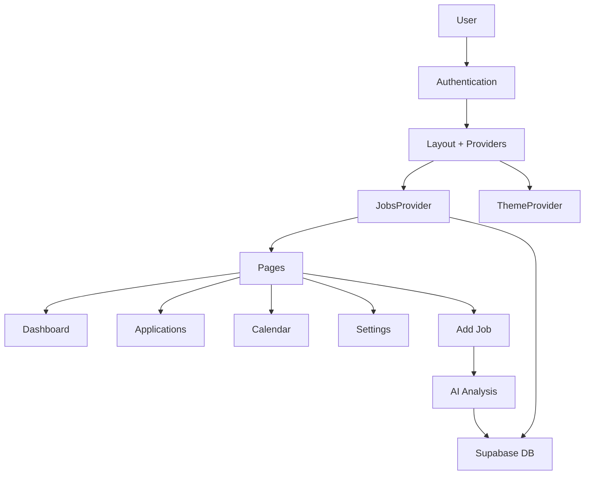

# Applyo - Project Documentation

> **Comprehensive guide to the Applyo job application tracking system**

## Table of Contents

1. [Project Overview](#project-overview)
2. [Architecture](#architecture)
3. [Project Structure](#project-structure)
4. [Core Components](#core-components)
5. [Pages](#pages)
6. [Data Models](#data-models)
7. [State Management](#state-management)
8. [API & Actions](#api--actions)
9. [Utilities & Libraries](#utilities--libraries)
10. [Styling & Design](#styling--design)

---

## Project Overview

**Applyo** is a modern job application tracking system built with Next.js 16, React 19, Supabase, and AI-powered job analysis. It helps users manage their job search process with features like:

- 📊 Dashboard with statistics and insights
- 📝 Application tracking with multiple views (List & Kanban)
- 📅 Calendar for interview scheduling
- 🤖 AI-powered job posting analysis (Google Gemini)
- ✉️ Email template management
- 🎨 Dark/Light theme support
- 🔐 Supabase authentication

**Tech Stack:**
- **Framework:** Next.js 16.1.4 (App Router, Turbopack)
- **UI:** React 19, Framer Motion, Lucide Icons
- **Styling:** Tailwind CSS 4, Glassmorphism design
- **Backend:** Supabase (PostgreSQL, Auth, Storage)
- **AI:** Google Gemini API
- **Drag & Drop:** @dnd-kit
- **State:** React Context API

---

## Architecture

### Application Flow



### Data Flow

1. **Authentication:** User logs in via Supabase Auth
2. **Data Fetching:** `JobsProvider` fetches jobs and templates from Supabase
3. **State Management:** React Context provides global state
4. **UI Updates:** Components consume context and render data
5. **Mutations:** User actions trigger Supabase updates via provider methods

---

## Project Structure

```
src/app/
├── actions/              # Server actions
│   └── analyze-job.ts    # AI job analysis
├── add/                  # Add job page
│   └── page.tsx
├── applications/         # Applications list/kanban
│   └── page.tsx
├── calendar/             # Calendar view
│   └── page.tsx
├── components/           # Reusable components
│   ├── AuthForm.tsx      # Login/Register form
│   ├── KanbanBoard.tsx   # Drag & drop board
│   ├── Sidebar.tsx       # Navigation sidebar
│   ├── ThemeToggle.tsx   # Light/Dark toggle
│   └── UserDropdown.tsx  # User menu
├── hooks/                # Custom hooks
│   └── useJobs.ts        # Jobs context consumer
├── lib/                  # Libraries & utilities
│   ├── data.ts           # Type definitions
│   └── supabase/         # Supabase clients
│       ├── client.ts     # Client-side
│       ├── server.ts     # Server-side
│       └── middleware.ts # Auth middleware
├── login/                # Login page
│   └── page.tsx
├── providers/            # Context providers
│   └── JobsProvider.tsx  # Jobs state management
├── register/             # Registration page
│   └── page.tsx
├── settings/             # Settings page
│   └── page.tsx
├── globals.css           # Global styles
├── layout.tsx            # Root layout
├── page.tsx              # Dashboard (home)
└── providers.tsx         # Theme provider
```

---

## Core Components

### 1. **Sidebar** (`components/Sidebar.tsx`)

**Purpose:** Main navigation menu

**Props:**
- `isOpen: boolean` - Controls visibility
- `onClose: () => void` - Close handler

**Features:**
- Responsive (mobile overlay, desktop static)
- Active route highlighting with animated background
- Logo and branding
- "Add Job" CTA button

**Key Functions:**
- Renders navigation links with icons
- Uses `usePathname()` to detect active route
- Framer Motion for smooth animations

---

### 2. **KanbanBoard** (`components/KanbanBoard.tsx`)

**Purpose:** Drag-and-drop job board

**Props:**
- `jobs: Job[]` - List of jobs to display
- `onJobClick: (job: Job) => void` - Click handler

**Features:**
- 4 columns: Entwurf, Beworben, Interview, Erledigt
- Drag & drop to change status
- Real-time Supabase updates
- Animated card movements

**Key Functions:**
- `handleDragStart(event)` - Sets active dragged item
- `handleDragEnd(event)` - Updates job status in database
- Uses `@dnd-kit` for drag & drop functionality

**Sub-components:**
- `KanbanColumn` - Droppable column container
- `KanbanCard` - Draggable job card
- `JobCardContent` - Card visual content

---

### 3. **ThemeToggle** (`components/ThemeToggle.tsx`)

**Purpose:** Switch between light/dark modes

**Features:**
- Sun icon (dark mode) / Moon icon (light mode)
- Smooth rotation animations
- Persists theme preference
- Prevents hydration mismatch

**Key Functions:**
- Uses `next-themes` `useTheme()` hook
- `setTheme()` toggles between 'dark' and 'light'

---

### 4. **UserDropdown** (`components/UserDropdown.tsx`)

**Purpose:** User profile menu

**Props:**
- `user: SupabaseUser` - Current user object

**Features:**
- Avatar display (image or initials)
- User name and email
- Settings link
- Logout button
- Animated dropdown

**Key Functions:**
- `handleLogout()` - Signs out and redirects to login
- Click-outside detection to close dropdown

---

### 5. **AuthForm** (`components/AuthForm.tsx`)

**Purpose:** Unified login/register form

**Props:**
- `mode: 'login' | 'register'` - Form type

**Features:**
- Email/password authentication
- Google OAuth integration
- Form validation
- Error handling
- Loading states

**Key Functions:**
- `handleSubmit()` - Authenticates via Supabase
- `handleGoogleLogin()` - OAuth flow

---

## Pages

### 1. **Dashboard** (`page.tsx`)

**Purpose:** Overview of job search progress

**Features:**
- Statistics cards (Active Applications, Interviews, Follow-ups)
- Upcoming interviews list
- Status quo chart placeholder
- Quick action CTA

**Key Functions:**
- `getDayJobs(d, m, y)` - Filters jobs by date
- Calculates follow-ups (applications > 7 days old)

**Data Displayed:**
- Active job count
- Interview count
- Follow-up count
- Next 3 upcoming interviews

---

### 2. **Applications** (`applications/page.tsx`)

**Purpose:** Main job tracking interface

**Features:**
- List view (table) and Kanban view toggle
- Search functionality
- Job detail slide-over
- Inline editing
- Status and priority updates
- Email template integration
- Preparation checklist

**Key Functions:**
- `handleOpenJob(job)` - Opens detail drawer
- `handleSaveEdit()` - Updates job in database
- `handleCopyTemplate(templateBody, job)` - Copies email with placeholders filled
- `toggleTask(job, taskIndex)` - Marks prep tasks complete

**State:**
- `view: 'list' | 'kanban'` - Current view mode
- `selectedJob: Job | null` - Job in detail drawer
- `isEditing: boolean` - Edit mode toggle
- `editFormData: Job | null` - Form state

---

### 3. **Calendar** (`calendar/page.tsx`)

**Purpose:** Visual calendar of interviews and deadlines

**Features:**
- Month view with navigation
- Job events on specific dates
- Color-coded by status
- Click to filter applications

**Key Functions:**
- `handlePrevMonth()` / `handleNextMonth()` - Navigate months
- `getDayJobs(d, m, y)` - Gets jobs for specific date
- Calculates calendar grid (42 days including prev/next month)

**Data Displayed:**
- Current month/year
- Jobs with `date` field
- Event count per day

---

### 4. **Add Job** (`add/page.tsx`)

**Purpose:** Create new job applications

**Features:**
- 2-step process (AI import or manual)
- URL-based AI analysis (Google Gemini)
- Manual form entry
- Form validation

**Key Functions:**
- `handleAnalyze()` - Calls AI to extract job details from URL
- `handleSubmit()` - Saves job to Supabase
- Uses `analyzeJob` server action

**Form Fields:**
- Title, Company, Location
- Description/Notes
- Status, Priority

---

### 5. **Settings** (`settings/page.tsx`)

**Purpose:** User preferences and account management

**Features:**
- 5 tabs: Profile, Templates, Security, Notifications, Data
- Avatar upload (Supabase Storage)
- Email template CRUD
- Profile metadata editing
- Export/delete data options

**Key Functions:**
- `handleUpdateProfile()` - Updates user metadata
- `handleAvatarClick()` / `handleFileChange()` - Avatar upload
- `addTemplate()` / `updateTemplate()` / `deleteTemplate()` - Template management
- `handleLogout()` - Sign out

**Tabs:**
1. **Profile:** Name, job title, location preference, resume link, avatar
2. **Templates:** Email template management with placeholders
3. **Security:** Email/password changes
4. **Notifications:** (Placeholder)
5. **Data:** Export CSV, delete all data

---

## Data Models

### Job Interface (`lib/data.ts`)

```typescript
interface Job {
  id: string;
  title: string;
  company: string;
  location: string;
  status: Status;
  priority: 'High' | 'Medium' | 'Low';
  lastUpdate: string;
  nextStep?: string;
  date?: string;
  notes?: string;
  prepTasks?: { text: string; completed: boolean }[];
  description?: string;
  summary?: string;
  requirements?: string[];
  benefits?: string[];
  skills?: string[];
  contactPerson?: string;
}
```

**Fields:**
- `id` - Unique identifier
- `title` - Job position name
- `company` - Company name
- `location` - Job location
- `status` - Current stage (Merkliste, In Vorbereitung, Beworben, Interview, Angebot, Absage, Archiv)
- `priority` - Importance level
- `lastUpdate` - Last modification date
- `date` - Interview/deadline date
- `prepTasks` - Preparation checklist
- `description` - Full job description
- `summary` - AI-generated summary
- `requirements` - Job requirements list
- `benefits` - Company benefits
- `skills` - Required skills/tech stack
- `contactPerson` - Recruiter/hiring manager name

---

### EmailTemplate Interface

```typescript
interface EmailTemplate {
  id: string;
  name: string;
  subject: string;
  body: string;
  isDefault?: boolean;
}
```

**Placeholders:**
- `{company}` - Company name
- `{job_title}` - Position title
- `{contact_name}` - Contact person
- `{user_name}` - User's full name
- `{location}` - Job location
- `{date}` - Current date

---

## State Management

### JobsProvider (`providers/JobsProvider.tsx`)

**Purpose:** Global state for jobs and templates

**Context Value:**
```typescript
{
  jobs: Job[];
  templates: EmailTemplate[];
  addJob: (newJob) => Promise<void>;
  updateJob: (updatedJob) => Promise<void>;
  deleteJob: (id) => Promise<void>;
  archiveJob: (id) => Promise<void>;
  restoreJob: (id) => Promise<void>;
  addTemplate: (template) => Promise<void>;
  updateTemplate: (template) => Promise<void>;
  deleteTemplate: (id) => Promise<void>;
  fetchJobs: () => Promise<void>;
  fetchTemplates: () => Promise<void>;
  isLoaded: boolean;
  user: User | null;
}
```

**Key Functions:**

1. **fetchJobs()** - Fetches all jobs from Supabase, maps database fields to Job interface
2. **addJob(newJob)** - Inserts new job into database
3. **updateJob(updatedJob)** - Updates existing job
4. **deleteJob(id)** - Deletes job from database
5. **archiveJob(id)** - Sets status to 'Archiv'
6. **restoreJob(id)** - Sets status to 'Merkliste'
7. **fetchTemplates()** - Fetches email templates
8. **addTemplate() / updateTemplate() / deleteTemplate()** - Template CRUD

**Database Mapping:**
- Converts snake_case (DB) to camelCase (app)
- Provides default prep tasks if none exist
- Handles legacy string array format for tasks

---

### useJobs Hook (`hooks/useJobs.ts`)

**Purpose:** Consume JobsContext

**Usage:**
```typescript
const { jobs, addJob, updateJob, isLoaded } = useJobs();
```

**Error Handling:**
- Throws error if used outside JobsProvider

---

## API & Actions

### analyzeJob (`actions/analyze-job.ts`)

**Purpose:** Server action to analyze job postings with AI

**Function Signature:**
```typescript
async function analyzeJob(url: string): Promise<{
  data?: JobData;
  error?: string;
}>
```

**Process:**
1. Fetches HTML from provided URL
2. Cleans HTML (removes scripts, styles, nav, footer)
3. Sends cleaned text to Google Gemini API
4. Parses JSON response
5. Returns extracted job data

**Extracted Fields:**
- title, company, location
- description, summary
- requirements, benefits, skills

**Error Handling:**
- URL validation
- Timeout (20s)
- Bot detection handling
- JSON parsing errors

---

## Utilities & Libraries

### Supabase Clients

**1. Client-side** (`lib/supabase/client.ts`)
```typescript
export function createClient() {
  return createBrowserClient(
    process.env.NEXT_PUBLIC_SUPABASE_URL!,
    process.env.NEXT_PUBLIC_SUPABASE_ANON_KEY!
  );
}
```

**2. Server-side** (`lib/supabase/server.ts`)
- Uses cookies for auth
- Server components and API routes

**3. Middleware** (`lib/supabase/middleware.ts`)
- Refreshes auth tokens
- Protects routes

---

### Theme Provider (`providers.tsx`)

**Purpose:** Wraps app with next-themes

**Features:**
- System preference detection
- Persistent theme storage
- Prevents flash of wrong theme

---

## Styling & Design

### Design System

**Colors:**
- Primary: Blue 600 (`#2563eb`)
- Secondary: Indigo 700 (`#4338ca`)
- Success: Green 500
- Warning: Amber 500
- Error: Rose 500

**Typography:**
- Primary: Inter (sans-serif)
- Accent: Lora (serif, for branding)
- Sizes: 10px (labels) to 4xl (headings)
- Weights: Bold (700), Black (900)

**Components:**
- **Glass Cards:** `backdrop-blur-xl`, semi-transparent backgrounds
- **Rounded Corners:** `rounded-[2rem]` to `rounded-[3.5rem]`
- **Shadows:** Layered with color-matched shadows
- **Animations:** Framer Motion for smooth transitions

**Responsive:**
- Mobile-first approach
- Breakpoints: sm (640px), md (768px), lg (1024px)

---

## Environment Variables

Required in `.env.local`:

```env
NEXT_PUBLIC_SUPABASE_URL=your-project-url
NEXT_PUBLIC_SUPABASE_ANON_KEY=your-anon-key
GEMINI_API_KEY=your-gemini-api-key
```

---

## Database Schema (Supabase)

### Tables:

**1. jobs**
- `id` (uuid, primary key)
- `user_id` (uuid, foreign key to auth.users)
- `title` (text)
- `company` (text)
- `location` (text)
- `status` (text)
- `priority` (text)
- `last_update` (date)
- `next_step` (text, nullable)
- `date` (date, nullable)
- `notes` (text, nullable)
- `prep_tasks` (jsonb, nullable)
- `contact_person` (text, nullable)
- `description` (text, nullable)
- `summary` (text, nullable)
- `requirements` (text[], nullable)
- `benefits` (text[], nullable)
- `skills` (text[], nullable)

**2. email_templates**
- `id` (uuid, primary key)
- `user_id` (uuid, foreign key)
- `name` (text)
- `subject` (text)
- `body` (text)
- `is_default` (boolean)

**3. avatars** (Storage Bucket)
- User profile images

---

## Key Features Explained

### 1. AI Job Analysis
- Uses Google Gemini Flash model
- Extracts structured data from job postings
- Handles various job board formats
- Fallback to manual entry if AI fails

### 2. Drag & Drop Kanban
- Built with @dnd-kit
- Smooth animations
- Real-time database updates
- Visual feedback during drag

### 3. Email Templates
- Placeholder system for personalization
- CRUD operations
- Copy to clipboard with filled placeholders
- Stored per-user in Supabase

### 4. Preparation Checklist
- Default tasks auto-generated
- Toggle completion status
- Persisted in database
- Visual progress tracking

---

## Development Commands

```bash
# Install dependencies
npm install

# Run development server
npm run dev

# Build for production
npm run build

# Start production server
npm start

# Type check
npx tsc --noEmit
```

---

## Deployment

**Platform:** Vercel (recommended)

**Steps:**
1. Push code to GitHub
2. Connect repository to Vercel
3. Add environment variables in Vercel dashboard
4. Deploy

**Environment Variables Needed:**
- `NEXT_PUBLIC_SUPABASE_URL`
- `NEXT_PUBLIC_SUPABASE_ANON_KEY`
- `GEMINI_API_KEY`

---

## Future Enhancements

- [ ] Email integration (send directly from app)
- [ ] Document upload (cover letters, resumes)
- [ ] Analytics dashboard with charts
- [ ] Notifications system
- [ ] Mobile app (React Native)
- [ ] Interview preparation resources
- [ ] Company research integration
- [ ] Salary tracking

---

**Last Updated:** January 30, 2026  
**Version:** 1.0.0  
**Author:** Adrian Kurten
